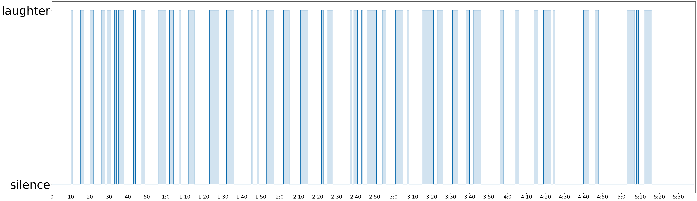

# watchmyset

The goal of this project was to create a laughter detector for stand-up comedy sets, such that it can statistically breakdown the number of laughs in a set, percentage of laughs, and plot the timepoints where a comedian got laughs. Since I'm interested only in the laughter of a crowd (I don't want the detector to label a single guy chuckling in the middle of a joke as a laugh), it differs a little from existing laugh detectors. 

To create this stand-up comedy set laugh detector, I trained a recurrant neural network on around ~20 stand-up comedy sets available on YouTube. These sets were chunked into 1 second .wav files, totalling about ~6000 .wav files, and hand-labeled for whether there was laughter. Each second was converted into its Mel-frequency Cepstral Coefficient (MFCC), essentially a mathematical transformation that converts a noisy .wav into a 99x13 set of features that somewhat approximates the way that the human ear breaks down sound. I then trained my RNN on this data. 

This trained model can then be used to reasonably detect laughter in stand-up comedy sets it hadn't been trained on. During training it reaches validation accuracy of ~92-93%, with most of the missed classifications being at the edges of laughs, which for the purposes of this project does not matter so much. 

The model was initially trained using code written on [Google Colaboratory](https://research.google.com/colaboratory/faq.html). 

The Google Colab notebook for training the model is located in this repo, named `WMS_train_model.ipynb`. (Suggested to open in Colab)

The Google Colab notebook for detecting laughter in YouTube videos is located in this repo, named `WMS_predict_YT.ipynb`. (Suggested to open in Colab). 

The dataset the model was trained can be downloaded here: https://drive.google.com/open?id=1hyINuRXl6QXOPwLZIDjNbThiTsCxOMpv

And the labeled CSVs corresponding to the above dataset can be downloaded here: https://drive.google.com/open?id=1cTRqzzFFzoC9QgOZ5OKecSgf8ROar5c7

Using this model, I also am creating a basic website allowing easy use of the trained model to detect laughs in stand-up comedy set. `wms.py` is a slightly more developed version of the above predict notebook, and `app.py` is the web server that using [Flask](https://flask.palletsprojects.com/en/1.1.x/) microframework. The `templates` folder contains a basic HTML UI for users to paste a YouTube link and see the laughter statistics. Currently all code is working for a local development server.
